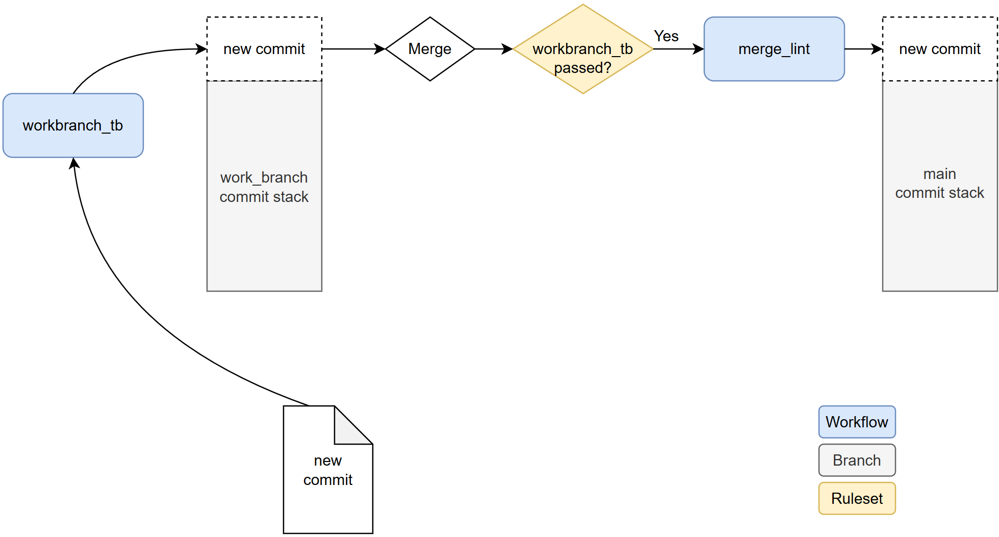

# Simple CI/CD for HW verification
A simple CI/CD pipeline for COMP.CE.420 course demonstration.

## Contains:
- Testbench on the 'work_branch'-branch to test incoming DUT.
- Linter that is automatically run when work_branch is being merged to main to format tb_top.cpp.
- Ruleset to prevent merging to branch if not all tests have passed.
- Pre-made DUTs for testing purposes.

## work_branch pipeline:
The incoming DUT is defined in root/top.sv. This DUT is expected to be a simple splitter where single input is divided to two outputs.

The testbench is defined in root/tb_top.cpp. If the DUT doesn't pass the tests, it can't be merged to main.

root/.github/workflows/workbranch_tb.yml config file controls GIT's actions and enables the pipeline functionality.

This workflow is triggered automatically when something is pushed to work_branch.

## Merge linter:
The linting rules are defined in root/.clang-format.

root/.github/workflows/merge_lint.yml config file controls GIT's actions and enable the linting operation.

This workflow is triggered automatically when something tries to merge with main.

## DUTs:
Different DUTs can be found from folder DUTs. Copy one from the subfolder and replace the one in the root of the repository with it.

These DUTs can be used to test the CI/CD.

DUT 00 = both outputs are bad.

DUT 10 = first output is good, the second one is bad.

DUT 11 = The DUT works as expected.